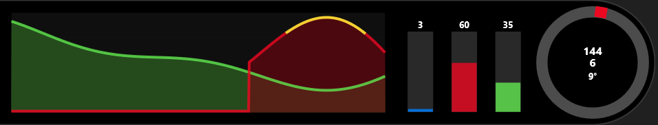

# iRonXtra — modern iRacing overlays

iRonXtra is a lightweight overlay suite for iRacing built in C++

This is a continuation of https://github.com/lespalt/iRon and https://github.com/SemSodermans31/iFL03

This is a personal project and not affiliated with iRacing or its developers.
It is provided as‑is without any warranty, and may break with future iRacing updates. Use at your own risk.

---

## How to get started

- Grab binaries from this repository’s Releases page.
- Start iRonXtra.exe (iRacing does not have to be running yet).
- Optionally use hotkey alt+p to toggle preview mode which should load up all overlays showing some dummy data.
- Windows can be resized and positioned using the mouse in edit mode that can be toggled with alt+j
- Further options can be found in config.json and it can be edited while iRonXtra is running.
- iRacing has to be running in borderless‑window mode for iRonXtra to be able to draw on top.

---

## Building from source

- CMake https://cmake.org/download/
- GCC https://code.visualstudio.com/docs/cpp/config-mingw
- Windows SDK https://learn.microsoft.com/en-us/windows/apps/windows-sdk/downloads
- Visual Studio Code https://code.visualstudio.com/ and "C/C++ Extension Pack"

---

## Dependencies

- Runtime: Only standard Windows components (Direct3D/Direct2D, DirectWrite, etc.).
- Source: iRacing SDK, picojson, and minimal helper code included in this repository.

---

## Credits & License

- iRonXtra is based on iRon by L. E. Spalt (lespalt).
- This is a fork of https://github.com/SemSodermans31/iFL03 with improvements and additions.
- License: MIT (see LICENSE). Please retain copyright notices in source files.

---

## Overlays

Below is a list of the main overlays included in iRonXtra, each with a screenshot and a some of the features available.
Examine and edit config.json for more info.

### Relative

Competitor list centered on your car with many features:
- Position, car number, driver name
- License or SR, iRating (k notation)
- Pit age (laps since last stop) with PIT indicator when on pit road
- Last lap, delta to you, and average of last 5 laps (L5) color‑coded vs your L5
- Positions gained/lost (+/−) with color
- Buddy and flagged highlighting, optional class colors; pace car handling
- Optional minimap (relative or absolute)
- Scroll the list with the mouse wheel when there are many cars

### Standings

Full‑field view with class awareness and a compact, readable grid:
- Position, car number, driver/team name
- Pit age with live PIT indicator
- License/SR and iRating
- Car brand icon per entry (loaded from assets) when available
- Gap (time or laps), last lap, best lap (highlight class fastest), delta to you
- Average of last 5 laps (L5) color‑coded vs your own L5
- Configurable number of “top”, “ahead” and “behind” rows and auto scroll bar
- SoF, track temp, session end and laps summary footer
- Multiclass Banners that differ per class

### DDU (Dashboard)

Compact dashboard with everything you’d otherwise flip through in black boxes:
- Gear and speed, RPM shift lights and rev limiter alert
- Current lap and laps remaining (or time‑to‑go)
- Position and lap delta to leader
- Best, last, and P1’s last lap
- Delta vs session best (green/red bar)
- Session clock, incident count, brake bias
- Oil and water temperatures (C/F with warnings)
- Fuel module with: remaining fuel, per‑lap average, estimated laps left, fuel to finish, scheduled add, progress bar; auto‑filters laps under cautions or pit to keep averages clean; safety factor configurable
- Tire wear (LF/RF/LR/RR) and service indicators

### Inputs

Pedal traces and steering visualization for driving consistency work:
- Scrolling throttle and brake traces (configurable thickness/colors)
- ABS brake trace and extra visual indicator when active as background of overlay turns yellow (can be turned off if too distracting)
- Vertical percentage bars for clutch, brake, throttle with numeric readouts
- Steering indicator: ring + rotating column or an image wheel (Moza KS / RS v2)
- On‑wheel speed and gear when using the built‑in ring

### Delta

Circular delta with trend‑aware coloring and prediction:
- Reference modes: all‑time best, session best, all‑time optimal, session optimal, and a fallback to last lap
- Only shows once you’re on track, out of the pits, and past initial sector; hides otherwise
- Outer progress ring scales with delta magnitude (up to ±2.00s)
- Side panel shows reference lap time and predicted current lap time (reference + delta)
- Auto scales gracefully with overlay size

### Flags

High‑contrast two‑band banner for session and race control flags:
- Top band on a dark background with the flag’s color; bottom band uses the flag color as background
- Handles iRacing’s full set of flags (black/penalty, meatball/repair, red, green, yellow, white, blue, debris, crossed, start‑ready/set/go, caution variants, one/five/ten‑to‑go, disqualify, etc.)
- Preview mode lets you force a specific flag for stream layout testing

### Weather

Vertical weather pillar with clear typography and iconography:
- Track temperature with units (C/F)
- Track wetness bar (sun ←→ water) based on iRacing’s 0–7 wetness enum
- Precipitation percentage when relevant, otherwise shows air temperature
- Wind compass: car fixed in the center; arrow shows wind flow over the car (wind minus car yaw)
- Updates at a sensible cadence (weather changes are gradual)

### Track Map

Scaled track rendering with start/finish markers and cars:
- Loads normalized points from assets/tracks/track‑paths.json (by trackId)
- Auto scale/center to overlay; configurable stroke widths and colors
- Draws start/finish (and extended) lines perpendicular to the path tangent
- Self marker highlighted with number; optional opponents with class colors; pace/safety car handling
- Auto‑detect start offset when crossing S/F; manual start offset and reverse direction supported

### Radar

Proximity radar with readable distance cues:
- Circular background (optional)
- Guide lines at 8 m front/back and 2 m left/right near the car
- Yellow zones (8–2 m) and red zones (≤2 m) for front/back with subtle radial fades
- Red side zones for close lateral proximity, biased by the opponent’s along‑track location
- Sticky timers to avoid flicker as cars move in/out of thresholds

### Traffic

Modern display to inform the user of different class vehicles behind them.
- shows the class, car number and brandname
- also displays distance behind in time and meters or feet

### Cover

Plain rectangle that can hide distracting in‑car dashes (e.g., next‑gen stock car). Useful for broadcasts and focused driving.

Screenshot: (not applicable)

## Tire
Shows tire data from iRacing SDK, a limitation is that this is only static and gets updated if you drive into your pitbox and out again.

## Fuel
Displays live fueldata in a comprehensive view. Able to edit the value for extra fuel that is calculated is possible if you are a good fuel saver and feel like the data is inaccurate.

## Pitlane
Displays handy information when driving into the pitlane.
- On pit entry/exit, it tells you when to engage pitlimiter
- In pitlane it shows speed and distance to pitbox

